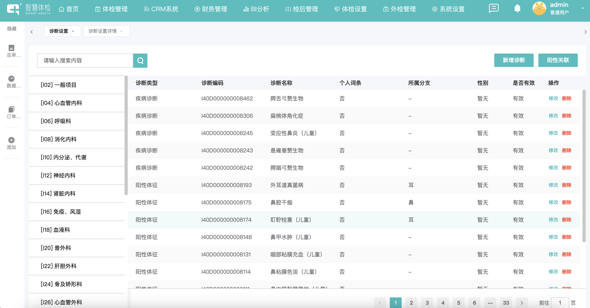
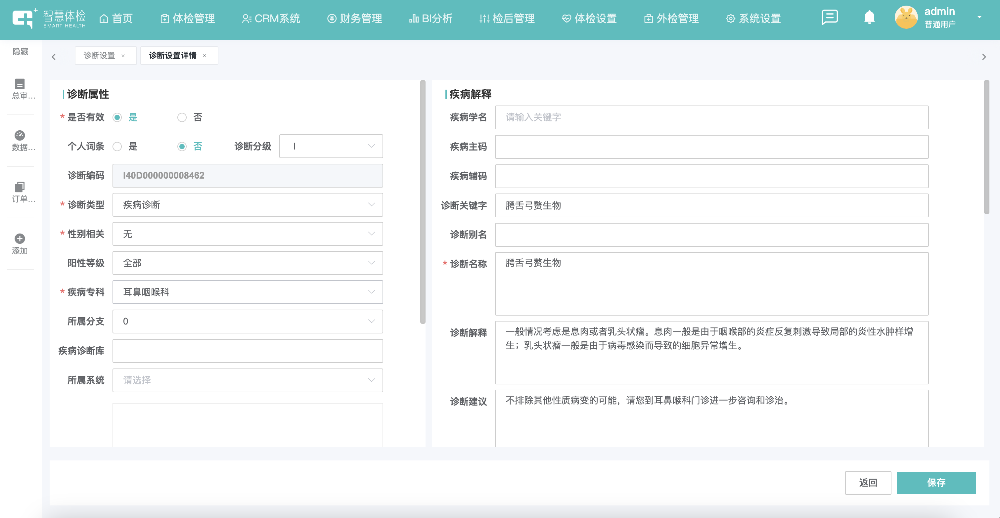
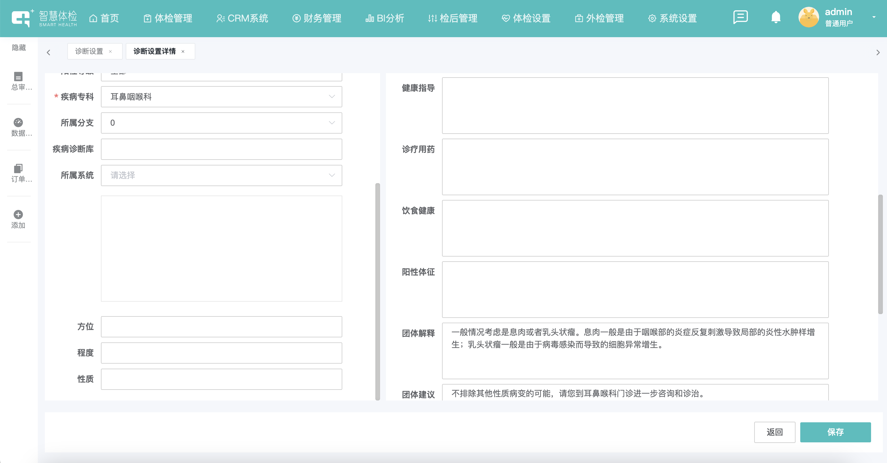
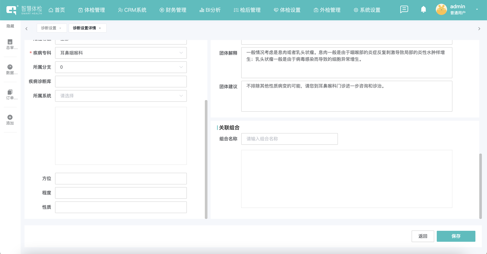
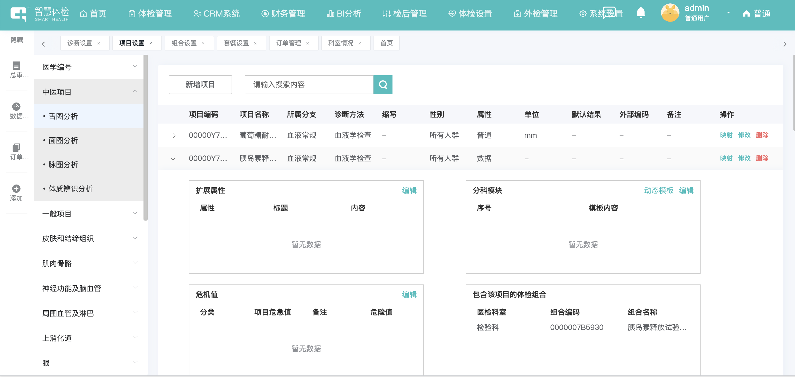
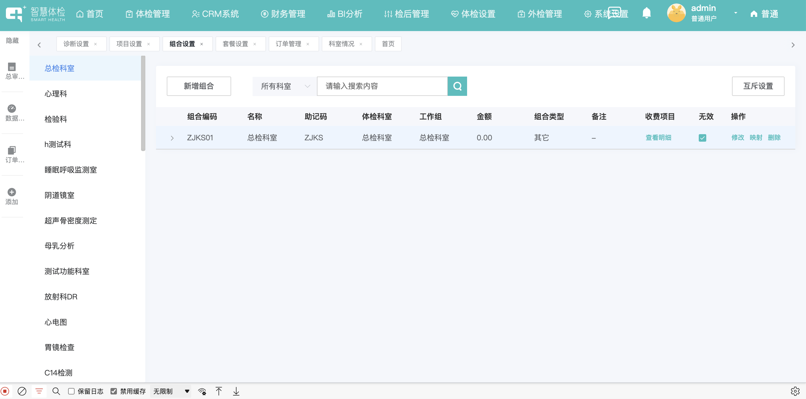
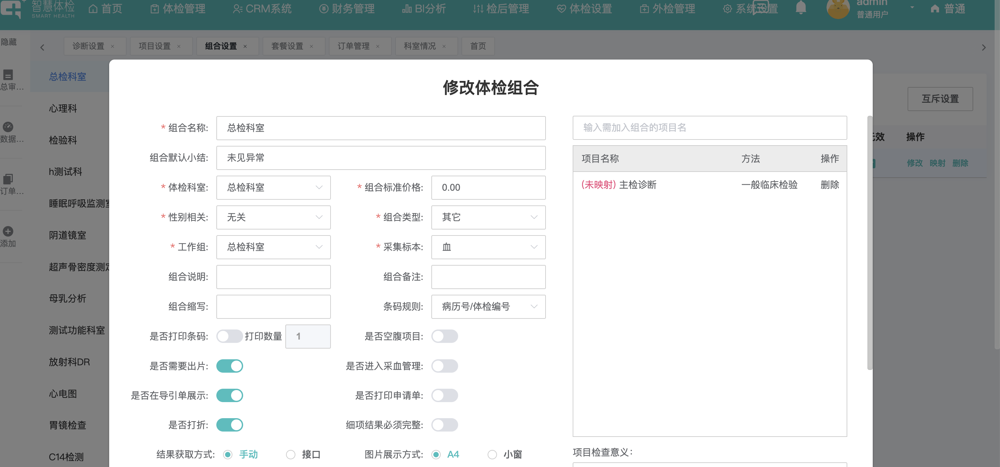
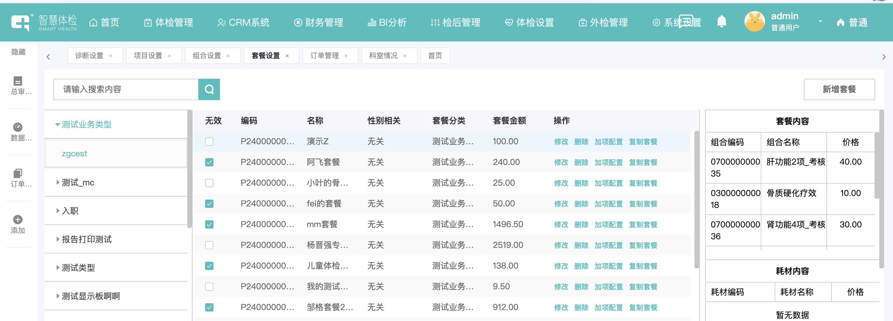
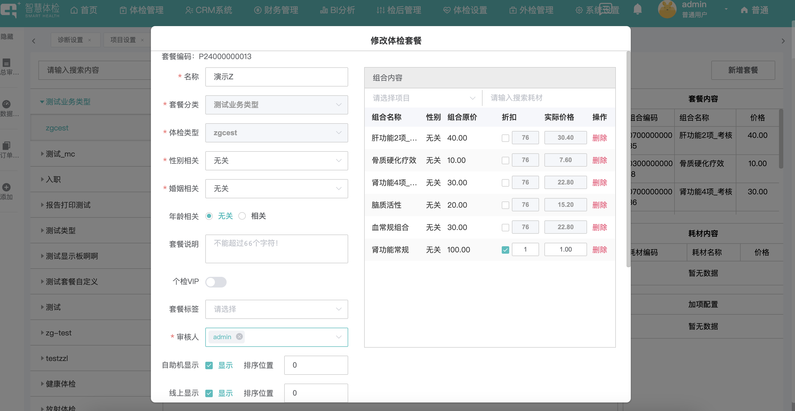
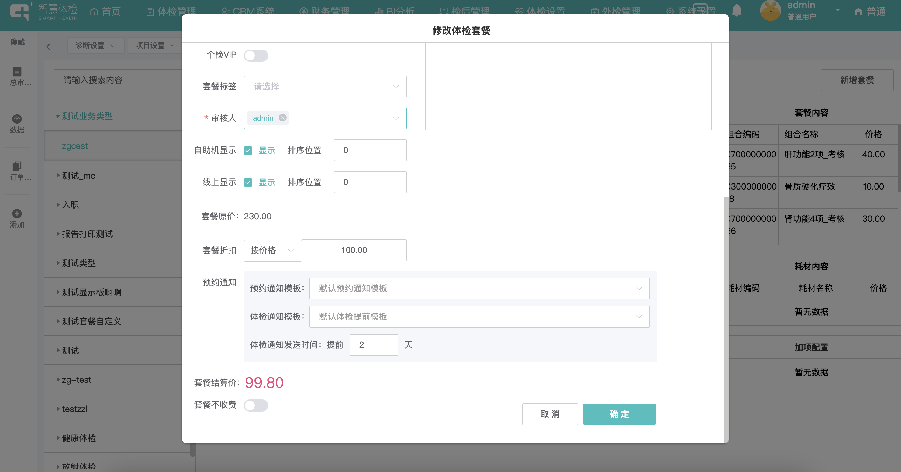

# 智慧体检爬虫

url: http://81.71.41.57:8800/dist/#/

- `diag`: 诊断设置
- `item`: 项目设置
- `union`: 组合设置
- `package`: 套餐设置

## diag

诊断设置

- 疾病目录: http://81.71.41.57:8800/manager/api/dictdiag/diag_menu_get

- 疾病列表: http://81.71.41.57:8800/manager/api/dictdiag/diag_list_get?diag_class_id=934&start=0&page_size=15&keywords=

- 疾病详情: http://81.71.41.57:8800/manager/api/dictdiag/diag_detail_get?diag_id=8462

```python
# diag_id id
# diag_name 诊断名称
# diag_code 诊断编码
# diag_gender 性别 0-暂无 1-男 2-女
# diag_type_name 诊断类型
# diag_branch_name 所属分支
# status 状态 0-有效 1-停用

# diag_advise 诊断建议
# diag_ail_explain 诊断解释
# diag_ail_group_explain 团体解释
# diag_group_advise 团体建议
# diag_keywords 诊断关键字
```





## item

- 项目目录: http://81.71.41.57:8800/manager/api/dictitem/item_menu_get

项目列表: http://81.71.41.57:8800/manager/api/dictitem/item_list_get?item_class_id=&item_branch_id=&keywords=&start=0&page_size=15

项目详情: http://81.71.41.57:8800/manager/api/dictitem/item_info_get?item_id=2051


```python
# item_class_name 项目分类名称
# item_branch_name 项目分支名称

# item_name 项目名称
item_branch_name 项目所属分支
item_code 项目编码
item_method_name 诊断方法
item_short 缩写
item_gender_rel_name 性别
item_data_type_name 属性
item_unit 单位

item_ext 扩展属性
item_risk 危机值
item_template 分科模块
union_list 包含该项目的体检组合
```



## union

- 科室列表: http://81.71.41.57:8800/manager/api/dictunion/examdept_list_get
- 组合列表: http://81.71.41.57:8800/manager/api/dictunion/union_list_get?exam_dept_id=80&start=0&page_size=15
- 组合详情: http://81.71.41.57:8800/manager/api/dictunion/item_list_get?union_id=2932

```python
exam_dept_name 科室名称
exam_dept_id 科室id

union_name 名称
union_code 组合编码
union_help_code 助记码
exam_dept_name 体检科室
work_group_name 工作组
union_fee 金额
union_type_name 组合类型

item_list 组合列表
item_name 项目名称
item_method_name 方法

union_default_summary 组合默认小结
union_collect_sample 采集标本
union_name 组合名称
```




## package

- 套餐分类: http://81.71.41.57:8800/manager/api/package/package_category
- 套餐列表: http://81.71.41.57:8800/manager/api/package/dict_package_list?pagesize=999&pkg_class_item_id=15769
- 套餐详细内容: http://81.71.41.57:8800/manager/api/package/dict_package_detail?pkg_id=1571

```python
name 套餐分类名称
    name 体检类型名称

pkg_code 编码
pkg_name 名称
pkg_gender_rel 性别相关 0-无关
pkg_class_name 套餐分类
pkg_fee 套餐金额
status 是否有效 0-无效 1-有效

pkg_name 名称
age_flag 年龄相关
union_list 套餐组合内容
    union_name 组合名称
    disc_int_rate 折扣
    disc_price 实际价格
    union_fee 组合原价
    union_gender_rel 性别
```





